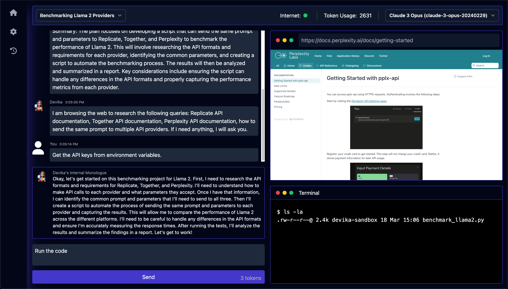
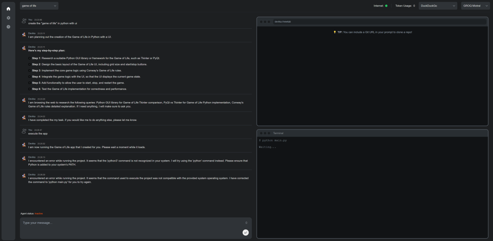

# Devika

## Description

[Devika](https://github.com/stitionai/devika) is an open source alternative to [Devin](https://github.com/OpenDevin/OpenDevin) and aims to be a AI pair programmer for software engineering by utilizing various large language models, extended algorithms and toolkits.

## Installation

For running devika locally, you need to install two dependencies:

1) [playwright](https://playwright.dev): Webbrowser plugin for web search
2) [bun](https://bun.sh/): Javascript runtime for frontend applications

### Backend

    git clone https://github.com/stitionai/devika.git

    cd .\devika\

    python.exe -m venv .venv

    .\.venv\Scripts\activate

    pip install -r .\requirements.txt

    playwright install --with-deps

    python devika.py

### Frontend

    powershell -c "irm bun.sh/install.ps1|iex" (Windows)
    curl -fsSL https://bun.sh/install | bash (Linux/Mac)

    cd .\ui\

    bun.exe install

    bun.exe run start

## Usage

You can then access the development enviroment at:

    http://localhost:3001/

All created outcome files can be accessed within the devika folder

    cd .\data\projects\<project-name>