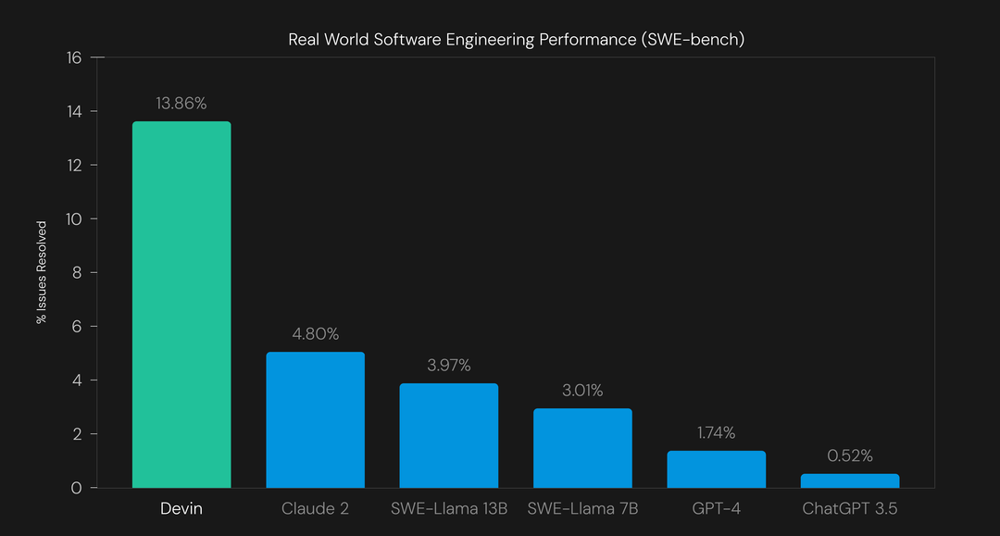
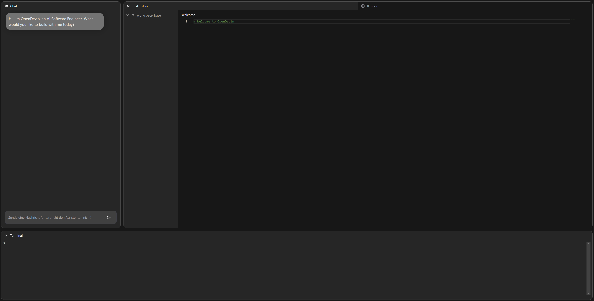

# Devin

Devin is a AI software engineer by [Cognition Labs](https://www.cognition-labs.com/) based on the agent technologie.
The developement is still in progress and requires to join a waitlist.

Currently devin is leading the [benchmark list](https://www.swebench.com/) for problems solving in SWE (software engineering):

## OpenDevin

Because devin is a closed source and requries joining a waitlist, there is an open source alternative called "OpenDevin":

    https://github.com/OpenDevin/OpenDevin

Here is tutorial for using it:

    https://www.youtube.com/watch?v=dKD4a_sv69o

## Installation

### Build

The easiest way to start OpenDevin is by using docker.
You can either build the image by yourself:

    git clone https://github.com/OpenDevin/OpenDevin.git

    docker build -t opendevin-app -f .\containers\app\Dockerfile .     

Or pull it from the registry (this was not working for me):

    docker pull ghcr.io/opendevin/opendevin:latest

### Run

Then start the image with this commands:

    # Your OpenAI API key, or any other LLM API key
    export LLM_API_KEY="sk-..."

    # The directory you want OpenDevin to modify. MUST be an absolute path!
    export WORKSPACE_DIR=$(pwd)/workspace

    docker run \
        -e LLM_API_KEY \
        -e WORKSPACE_MOUNT_PATH=$WORKSPACE_DIR \
        -v $WORKSPACE_DIR:/opt/workspace_base \
        -v /var/run/docker.sock:/var/run/docker.sock \
        -p 3000:3000 \
        ghcr.io/opendevin/opendevin:latest

### Usage

Open the website 

    http://localhost:3000

and you get welcomed with this screen

After you gave a task you can find the created artifacts in the defined workspace directory