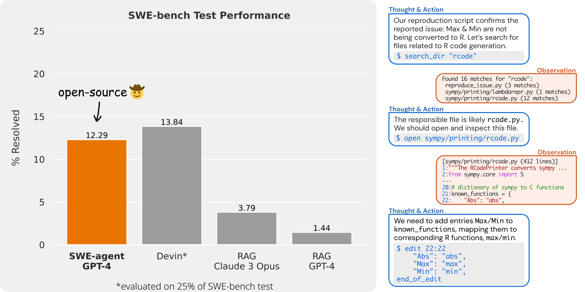
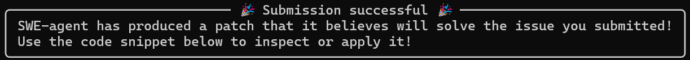

# SWE-agent

[SWE-agent](https://swe-agent.com/) is a an agent from students of the Princeton University that can fix real bugs and issues in GitHub repositories with a success rate of 12.3%

You can find a demo here:

    https://swe-agent.com/demo

and the repository here:

    https://github.com/princeton-nlp/SWE-agent

Video Tutorial:

    https://www.youtube.com/watch?v=9-JBHGlYEBI

## Keys and config file

For using this agent you need to have two keys available:

- **OPENAI_API_KEY**: https://platform.openai.com/api-keys
- **GITHUB_TOKEN**: https://github.com/settings/tokens/new

With this keys create a new file called `keys.cfg` with the following content:

    GITHUB_TOKEN: 'GitHub Token Here (required)'
    OPENAI_API_KEY: 'OpenAI API Key Here if using OpenAI Model (optional)'

## Installation

### Build

The easiest way to start swe-agent is by using docker.
You can either build the image by yourself:

    git clone https://github.com/princeton-nlp/SWE-agent.git

    docker build -t sweagent/swe-agent-run:latest .

Or pull it from the registry:

    docker pull sweagent/swe-agent:latest

### Run

Then start the image with this commands:

    docker run --rm -it -v /var/run/docker.sock:/var/run/docker.sock \
        -v $(pwd)/keys.cfg:/app/keys.cfg \
        sweagent/swe-agent-run:latest \
        python run.py --image_name=sweagent/swe-agent:latest \
        --model_name gpt4 \
        --data_path https://github.com/pvlib/pvlib-python/issues/1603 \
        --config_file config/default_from_url.yaml  --skip_existing=False

If you're using docker on Windows, use `-v //var/run/docker.sock:/var/run/docker.sock` (double slash) to escape it

### Final

If everything works as expected you should this this message

