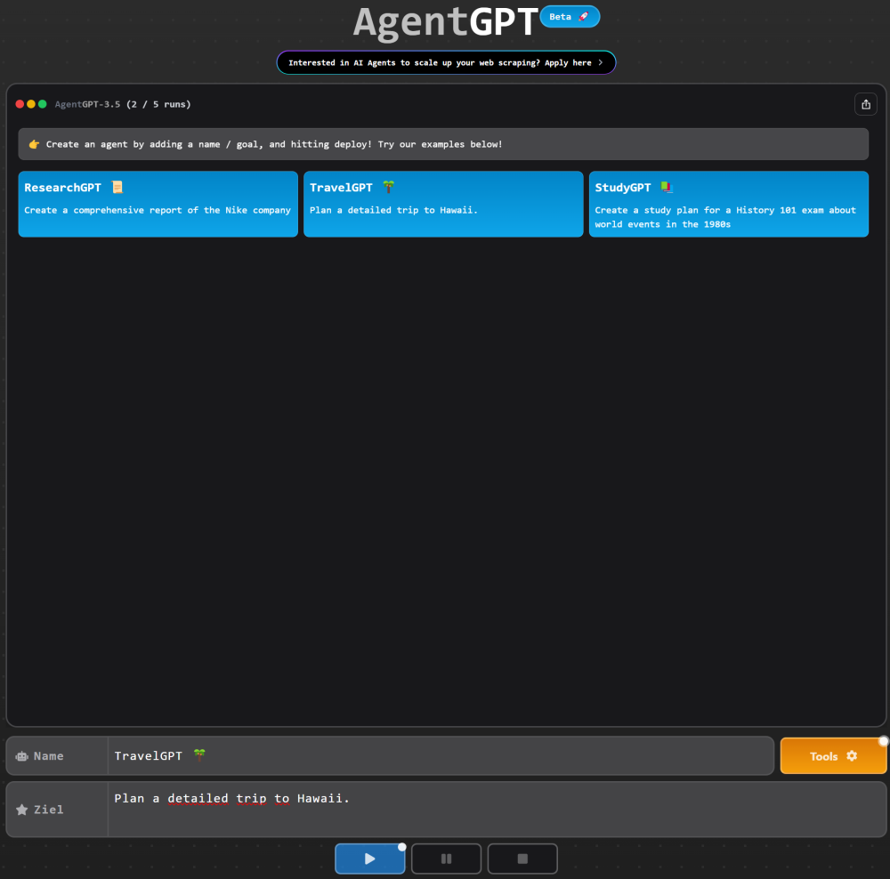

# AI Agents

## Introduction

This repository should give a quick introduction into the agent technologie.

### What are agents?

AI Agents are software entities that autonomously perform tasks, process data, make decisions, and interact with their environment or other agents. These agents are based on advanced algorithms and machine learning, enabling them to adapt to changing conditions and constantly learn. They surpass simple large language models because they perform tasks purposefully and can set themselves subsequent tasks.

Key-features:

- Perform tasks
- Make decisions
- Communicate with other agents

### How they work?

AI Agents are an advancement of existing algorithms, particularly Large Language Models (LLMs), utilize machine learning algorithms (ML) to derive patterns, rules, or models from collected data. Building on this, they can make decisions or execute tasks by using toolkits to interact with their environment. This ability to make decisions is the central aspect, as it enables them to utilize various tools such as specific programs, databases, etc.

### Quick example

There are already ready-made AI Agents that can be tested with more or less effort to install. An example is AgentGPT from the company reworkd, which can be accessed via a browser and which generates texts, images, and code. As a quick introductory example, TravelGPT can plan a trip:

    https://agentgpt.reworkd.ai

### Possible applications 

AI agents have a wide range of applications across various industries, enabling different functionalities and advancements:

- **Autonomous Vehicles**: AI agents power self-driving cars and drones, enabling them to perceive their environment, make decisions, and navigate safely without human intervention.
- **Virtual Assistants**: Agents like Siri, Alexa, and Google Assistant utilize AI to understand natural language, assist with tasks, provide information, and control smart devices.
- **Gaming**: AI agents in games simulate human-like behavior, enhance the gaming experience, and offer challenging opponents in single or multiplayer modes.
- **Healthcare**: AI agents aid in diagnostics, personalized medicine, drug discovery, patient monitoring, improving treatment outcomes, and operational efficiency.
- **Finance**: AI agents analyze vast amounts of financial data for fraud detection, trading, risk assessment, and personal financial advising.
- **Customer Support**: Chatbots and virtual agents handle customer inquiries, provide assistance, offer shopping advice, and deliver information across various industries.
- **Smart Homes and IoT**: AI agents control and optimize smart home devices, adjusting settings based on preferences and environmental conditions.
- **Robotics**: AI agents in robots enable them to perform tasks in manufacturing, logistics, healthcare, and more, adapting to dynamic environments.
- **Recommendation Systems**: AI agents power recommendation systems in streaming services, e-commerce, and content platforms, providing users with personalized suggestions.
- **Cybersecurity**: AI agents assist in threat detection, anomaly identification, and security management to defend against cyberattacks and ensure system integrity.
- **Education**: AI agents aid in personalized learning, adapting to students' individual needs, providing tutoring, and offering educational support.
- **Supply Chain and Logistics**: AI agents optimize routes, manage inventory, forecast demand, and improve overall efficiency in logistics operations.

___

## This Repository

For a hands-on experience this repository is seperated into three areas which build on each other:

1) Show capabilities of a single agent with "[langchain](notebook/langchain.ipynb)" (local: [ollama](notebook/ollama.ipynb))
2) Show capabilities of multiple agents working together with "[Crew AI](notebook/crewai.ipynb)"
3) Show automatic code problem solving with "[devika](docs/devika.md)", "[devin](docs/devin.md)" and "[SWE-agent](docs/swe.md)"

### Setup environment

All examples where executed with [python 3.12.2](https://www.python.org/downloads/)

For VS Code you need these extensions:

- **Jupyter**: https://marketplace.visualstudio.com/items?itemName=ms-toolsai.jupyter
- **Python**: https://marketplace.visualstudio.com/items?itemName=ms-python.python

To use the code examples (notebooks) in this repository you need to create a virtual python enviroment:

    python -m venv .venv

    .\.venv\Scripts\activate

    pip install -r .\requirements.txt

Then select this environment in VS Code on the top right side after opening a notebook file:

### Prepair language models

You can use different kind of language models for your agents. This is useful in relations to your given task so that each agent is based on a model which fits best for the action it should perform.

For doing so you need either an API Key

- **ChatGPT**: https://platform.openai.com/api-keys
- **Claude3**: https://console.anthropic.com/settings/keys
- **Mistral**: https://console.mistral.ai/api-keys/
- **Groq**: https://console.groq.com/keys

or in terms of saving costs and work autonomous you can also work with local language models as described here: [ollama](ollama.md) setup

Other popular models:

- Gemini
- Faclon
- Orca

To be up-to-date you can check [Huggingface](https://huggingface.co/models?sort=trending) regularly
